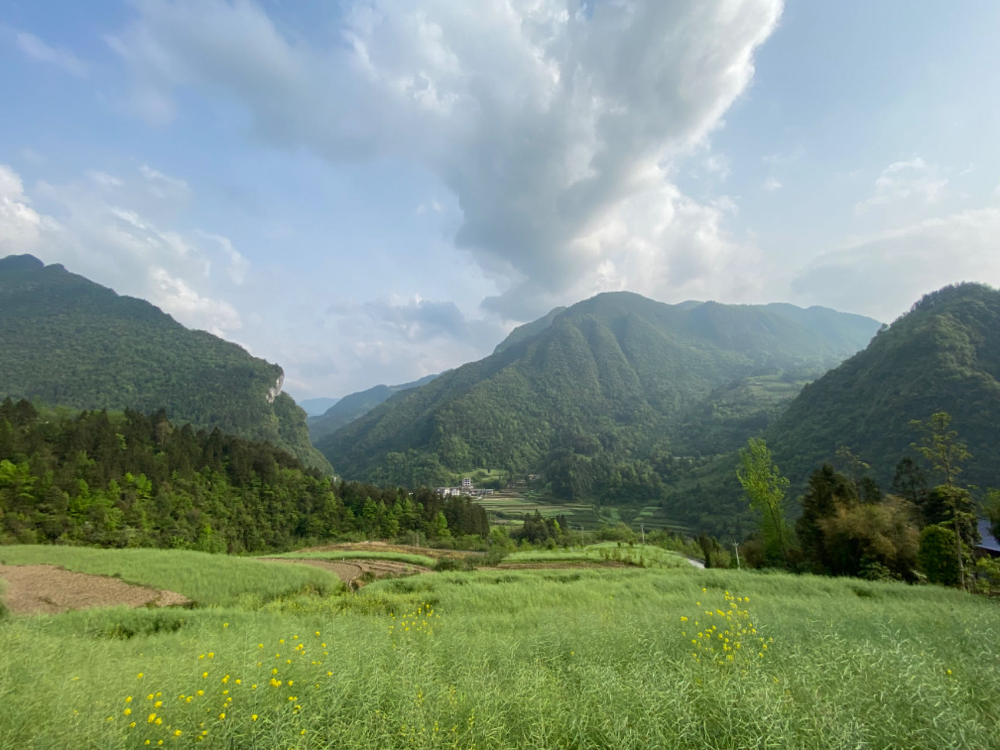

#### _久在樊笼里，复得返自然_

在湖北恩施乡村的一所图书馆里，我度过了人生中最为平静而快乐的十五天。那段时间，除了导员偶尔的催促，几乎没有任何值得焦虑的事。日子像溪水一样缓慢地流淌，悄无声息，却滋养心田。

在那个被群山环抱的小村庄，我获得了有记忆以来最安稳的睡眠。夜晚，虫鸣和远山缭绕的云雾交织成一首没有歌词的歌，温柔地托举我，带我从过往的焦虑与疲惫中慢慢浮起。白天，阳光透过图书馆木质的窗框洒进来，落在书页和木桌上，尘埃在光里悄然起舞，那一刻，连时间都变得轻缓。

我们一群人聚在一起，为孩子们讲故事、整理书架、清扫屋檐下积灰的角落，间或在傍晚沿着小路散步，聊一些未来、梦想、还有永远不会实现的浪漫。我们并不总是高谈阔论，更多时候，只是静静地坐着，看山，看云，看一本书翻过一页又一页。

如今，那些朋友早已天各一方，也许以后的人生里很难再相见。短暂的相遇，却久久不能忘怀——因为那是某种更接近本真的生活方式，一种在浮躁与焦虑之外，人与人、人与自然之间难得的、柔和的连接。

那段时间之后，我渐渐意识到，真正令人怀念的，不只是图书馆里的阳光、山谷间的云雾，或是朋友们的欢笑声，而是那种被安静包裹着的心情——一种不必赶路、不用比较、不需证明自己的状态。那是一种久违的自由，是心灵的松弛，是我在漫长岁月奔波中，难得拾起的宁静。

现代生活的节奏像一辆失控的列车，把我们推向一个又一个目标，一个又一个节点，快得甚至来不及呼吸。而在那短短十五天的时间里，用最温柔的方式提醒我：慢下来，不是逃避，而是为了看清；宁静，不是虚无，而是力量的源泉。

我开始相信，一个人真正的成长，也许并不在于他征服了多少高峰、完成了多少成就，而在于他是否学会了和自己独处，是否敢于面对内心的喧嚣并温柔地安抚它。对于过去我们应做的是重构而不是一遍遍的重复。正是那样的宁静，把我从现代社会的焦虑的泥沼里轻轻拉出，不需挣扎，也无需声张。它像山间的风，悄无声息，却把整个灵魂都洗净了。

回到城市后，每当我被任务、社交或未来压得喘不过气时，我便会想起那座图书馆——木制的窗棂、跳舞的尘埃、和缓的阳光。

这些画面好像只存在于记忆中，于现实中并没有发生。记得 2010 年普通高等学校招生考试北京卷作文题是“仰望星空与脚踏实地”，有很多人奔劳一生都没有抬头看看天上的星星，而我痴迷于星空却忘记了前行。我总是活在未来或过去，却从未活在现在。

